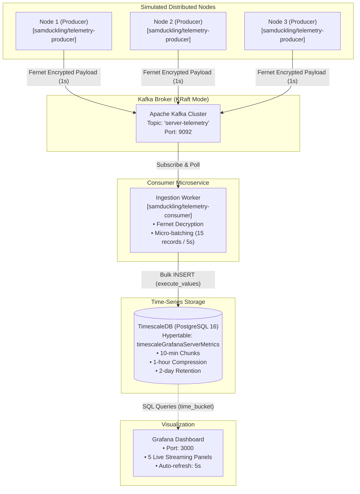

# Real-Time Distributed Telemetry & Server Monitoring Pipeline

An end-to-end, containerized telemetry streaming architecture that simulates distributed server nodes, encrypts system performance metrics at the edge, ingests high-throughput data via Apache Kafka (KRaft mode), stores time-series metrics in an optimized TimescaleDB hypertable, and visualizes live performance in Grafana[cite: 20, 26, 31].

---

## Architecture Overview



---

## Core System Architecture

### 1. Edge Telemetry Harvesting (`producer.py`)
Each simulated server node runs independently inside its own container[cite: 26]:
- **Telemetry Collection:** Uses `psutil` to sample host hardware metrics every 1 second: CPU utilization percentage (`cpu_pct`), virtual memory usage percentage (`mem_pct`), network bytes received/sent (`net_in`, `net_out`), and total disk read/write throughput (`disk_io`)[cite: 31].
- **Zero-Knowledge Wire Encryption:** Payloads are serialized to JSON and encrypted at the edge using Python's `cryptography.fernet` symmetric key cipher before dispatch[cite: 31]. The Kafka broker receives only encrypted byte buffers, preventing plaintext inspection[cite: 26, 31].
- **Node Identity:** Injected dynamically using the `SERVER_ID` environment variable (`NODE-1`, `NODE-2`, `NODE-3`)[cite: 26, 31].

### 2. Message Streaming via Apache Kafka (KRaft Mode)
- **ZooKeeper-Less Operation:** Powered by `confluentinc/cp-kafka:7.6.0` using the modern Kafka Raft (KRaft) consensus protocol (`KAFKA_PROCESS_ROLES: 'broker,controller'`), eliminating external ZooKeeper dependencies[cite: 26].
- **Dynamic Topic Handling:** Ingests events into the `server-telemetry` topic via an internal bridge network (`telemetry-net`)[cite: 26, 31].

### 3. Decryption & Micro-Batch Ingestion Worker (`consumer.py`)
- **Decryption:** Reads encrypted Kafka message values and decrypts them in memory via Fernet[cite: 25].
- **Micro-Batch Buffering:** Implements a dual-trigger commit strategy to balance throughput and latency[cite: 25]:
  - **Size Trigger:** Flushes when the buffer accumulates `KAFKA_BATCH_SIZE = 15` records[cite: 25].
  - **Time Trigger:** Flushes every `FLUSH_INTERVAL = 5` seconds if low traffic prevents the buffer from filling[cite: 25].
- **High-Performance Writes:** Uses `psycopg2.extras.execute_values` for bulk multi-row `INSERT` operations, minimizing database round-trips and transaction lock contention[cite: 25].
- **Safe Offsets:** Offsets are committed synchronously to Kafka only after TimescaleDB issues a successful transaction commit (`enable.auto.commit = False`)[cite: 25].

### 4. Time-Series Storage with TimescaleDB
PostgreSQL 16 extended with the TimescaleDB engine[cite: 20, 26]:
- **Hypertable Partitioning:** Converts `timescaleGrafanaServerMetrics` into a hypertable partitioned along the `ts` timestamp column with `chunk_time_interval => INTERVAL '10 minutes'`[cite: 20].
- **Native Columnar Compression:** Segments data by `server_id` and orders by `ts DESC`[cite: 20]. An automated policy compresses chunks older than **1 hour**[cite: 20].
- **Automated Data Retention:** Enforces a drop policy that discards raw metrics older than **2 days**[cite: 20].

### 5. Real-Time Observability (Grafana)
A containerized Grafana OSS service running on port 3000[cite: 26]:
- Queries the TimescaleDB hypertable directly using `time_bucket('5 seconds', ts)` aggregations[cite: 29].
- Displays 5 real-time panels: multi-series CPU trends, memory consumption graphs, network inbound/outbound gauges, and cumulative disk I/O metrics[cite: 29].

---

## Repository Structure

```text
.
├── .env.example                  # Environment variable template
├── .gitignore                    # Git tracking ignore rules
├── Dockerfile.consumer           # Consumer container build definition
├── Dockerfile.producer           # Producer container build definition
├── GRAFANA_DASHBOARD_CONFIG.json # Complete Grafana dashboard definition
├── init.sql                      # TimescaleDB hypertable, compression & retention schema
├── producer.py                   # System metric harvester & Fernet publisher
├── consumer.py                   # Decryptor, micro-batch buffer & TimescaleDB loader
├── requirements.txt              # Python runtime dependencies
├── docker-compose.yaml           # Multi-service container orchestrator
└── README.md                     # System documentation
```

---

## Pre-Built Docker Images

Pre-built Docker images are published to Docker Hub under the `samduckling` namespace[cite: 26, 34]:

- **Producer:** `samduckling/telemetry-producer:latest`[cite: 26, 34]
- **Consumer:** `samduckling/telemetry-consumer:latest`[cite: 26, 34]

---

## Quick Start Guide

### 1. Prerequisites
- [Docker Engine](https://docs.docker.com/engine/install/) (v24.0+)
- [Docker Compose](https://docs.docker.com/compose/) (v2.20+)
- Ports **3000**, **5432**, and **9092** must be free on the host machine[cite: 26].

> **Linux Note:** If native PostgreSQL or Grafana services are running locally, stop them to avoid host port collisions:
> ```bash
> sudo systemctl stop postgresql grafana-server
> ```

### 2. Clone the Repository
```bash
git clone [https://github.com/ShamantN/server-monitoring-dashboard.git](https://github.com/ShamantN/server-monitoring-dashboard.git)
cd server-monitoring-dashboard
```

### 3. Configure Secrets & Environment Variables
Generate a secure Fernet encryption key using Python:
```bash
python3 -c "from cryptography.fernet import Fernet; print(Fernet.generate_key().decode())"
```

Create your `.env` configuration file from the template:
```bash
cp .env.example .env
```

Open `.env` and verify the values:
```env
POSTGRES_DB=postgres
POSTGRES_USER=postgres
POSTGRES_PASSWORD=password123
POSTGRES_HOST=timescaledb
POSTGRES_PORT=5432

KAFKA_BOOTSTRAP_SERVERS=kafka:9092
KAFKA_FERNET_KEY=<PASTE_YOUR_GENERATED_FERNET_KEY_HERE>
```

### 4. Launch the Cluster
Start all 7 containers in detached mode[cite: 26]:
```bash
docker compose up -d
```

Verify that all services are running[cite: 26]:
```bash
docker compose ps
```

Expected output:
```text
NAME                    IMAGE                                   STATUS
producer_node_1         samduckling/telemetry-producer:latest   Up
producer_node_2         samduckling/telemetry-producer:latest   Up
producer_node_3         samduckling/telemetry-producer:latest   Up
telemetry_consumer      samduckling/telemetry-consumer:latest   Up
telemetry_grafana       grafana/grafana-oss:latest              Up
telemetry_kafka         confluentinc/cp-kafka:7.6.0             Up
telemetry_timescaledb   timescale/timescaledb:latest-pg16       Up
```

### 5. Monitor Ingestion Logs
Follow the consumer output to confirm decrypted micro-batches are being committed to TimescaleDB[cite: 25]:
```bash
docker compose logs -f consumer
```

Expected output[cite: 25]:
```text
Batch of size : 15 has been published to PostgreSQL, committed to Kafka and cleared from memory.
```

---

## Grafana Dashboard Setup

### 1. Access the Grafana UI
Open your browser and navigate to:
```text
http://localhost:3000
```
- **Username:** `admin`[cite: 26]
- **Password:** `s181916k00bvyu8`[cite: 26]

### 2. Add the TimescaleDB Data Source
1. In the left navigation menu, go to **Connections** $\to$ **Data sources** $\to$ click **Add data source**.
2. Select **PostgreSQL**.
3. Configure the following connection properties:
   - **Host URL:** `timescaledb:5432` *(Use the internal Docker DNS name)*
   - **Database name:** `postgres`
   - **Username:** `postgres`
   - **Password:** `password123`
   - **TLS/SSL Mode:** `disable`
   - **TimescaleDB:** Toggle **ON**
4. Click **Save & test**. You should see a green confirmation badge: *"Database Connection OK"*.

### 3. Import the Dashboard Model
1. In the left menu, go to **Dashboards** $\to$ click the **New** dropdown (top-right) $\to$ **Import**.
2. Click **Upload dashboard JSON file** and choose `GRAFANA_DASHBOARD_CONFIG.json`[cite: 29].
3. If prompted to map the PostgreSQL data source, select the `timescaledb` data source configured above.
4. Click **Import**.

The 5 monitoring panels will begin rendering real-time telemetry from `NODE-1`, `NODE-2`, and `NODE-3`[cite: 26, 29].

---

## Database Schema & Aggregation

### Schema Definition (`init.sql`)
```sql
CREATE EXTENSION IF NOT EXISTS timescaledb;

CREATE TABLE IF NOT EXISTS timescaleGrafanaServerMetrics (
    server_id TEXT NOT NULL,
    ts TIMESTAMPTZ NOT NULL,
    cpu_pct DOUBLE PRECISION,
    mem_pct DOUBLE PRECISION,
    net_in DOUBLE PRECISION,
    net_out DOUBLE PRECISION,
    disk_io DOUBLE PRECISION
);

-- Partition into 10-minute chunks
SELECT create_hypertable('timescaleGrafanaServerMetrics', 'ts', chunk_time_interval => INTERVAL '10 minutes', if_not_exists => TRUE);

-- Columnar compression policy for records older than 1 hour
ALTER TABLE timescaleGrafanaServerMetrics SET (
    timescaledb.compress,
    timescaledb.compress_segmentby='server_id',
    timescaledb.compress_orderby='ts DESC'
);
SELECT add_compression_policy('timescaleGrafanaServerMetrics', INTERVAL '1 hour');

-- Retention policy dropping records older than 2 days
SELECT add_retention_policy('timescaleGrafanaServerMetrics', INTERVAL '2 days');
```
[cite: 20]

### Sample Panel Query (CPU Usage)
Downsamples high-frequency streaming events into 5-second averages using TimescaleDB's `time_bucket` function[cite: 29]:
```sql
SELECT
  time_bucket('5 seconds', ts) AS "time",
  server_id AS "SERVER",
  avg(cpu_pct) AS "AVG_CPU"
FROM timescalegrafanaservermetrics
WHERE $__timeFilter(ts)
GROUP BY 1, 2
ORDER BY 1;
```
[cite: 29]

---

## Verification & Troubleshooting

### Inspect Ingested Rows in TimescaleDB
To verify row counts directly in the database hypertable:
```bash
docker compose exec timescaledb psql -U postgres -d postgres -c \
  "SELECT server_id, COUNT(*), MAX(ts) FROM timescaleGrafanaServerMetrics GROUP BY server_id;"
```

### Inspect Kafka Topics
To verify the Kafka topic and partition metadata:
```bash
docker compose exec telemetry_kafka kafka-topics \
  --bootstrap-server localhost:9092 \
  --describe --topic server-telemetry
```

### Common Issues
1. **Port 5432/3000 Already in Use:**
   - Stop native host services: `sudo systemctl stop postgresql grafana-server`.
2. **Temporary Failure in Name Resolution:**
   - If containers fail to resolve `kafka` or `timescaledb`, run `docker compose down`, clean up stale networks with `docker network prune -f`, and restart with `docker compose up -d`.

---

## Teardown

Stop and remove all containers while preserving data volumes:
```bash
docker compose down
```

To stop containers and delete all persistent volumes (resetting TimescaleDB, Kafka, and Grafana storage):
```bash
docker compose down -v
``` 